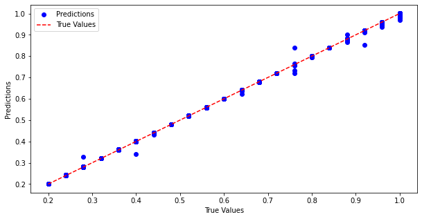
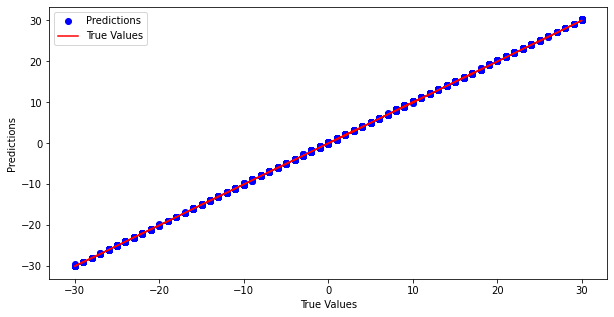
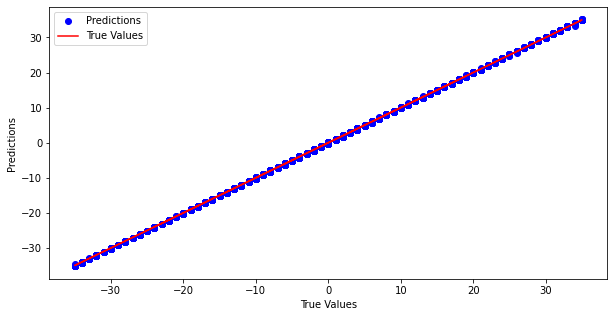

# Model_training

The neural network architecture used in this project consists of the following layers:

- Input Layer: Accepts the input data with a size equal to the number of features in the left-hand side of the dataset.
- Hidden Layer 1: 64 neurons with ReLU activation function.
- Hidden Layer 2: 32 neurons with ReLU activation function.
- Output Layer: Produces the output with a size equal to the number of features in the right-hand side of the dataset.
The model is compiled using the mean squared error (MSE) loss function and the Adam optimizer.

## Training
The model is trained for 10 epochs with a batch size of 16. The training process can be monitored through the history variable in the script.

## Test Data Evaluation
After training, the model can be evaluated on test data to assess its performance. A test dataset is created by selecting every 10th row from the original data.

Value0

Value1

Value2

## Download the Trained Model
You can easily access and download the trained model for your use by following the link below:

- [Google Drive](https://drive.google.com/drive/folders/1veI4L3w63aeVda8lfIInfWJvig9UACgC?usp=drive_link)

## Model Conversion for iOS

After training the model, it was converted to the .mlmodel format for seamless integration with iOS applications. This conversion allows the model to be deployed on iOS devices and used for inference within iOS apps.

